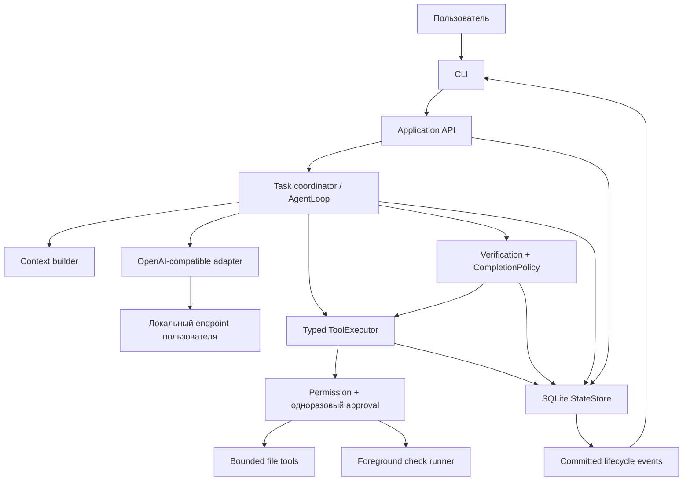

# Nexus v1.0 — Architecture

Дата: 2026-09-09. Статус: **целевая архитектура, не описание реализованного продукта**. Решения: [NEXUS_ADR.md](C:/Nexus_History/NEXUS_ADR.md). Evidence: [Analysis Summary](C:/Nexus_History/NEXUS_ANALYSIS_SUMMARY.md). Исправления после red-team перечислены в конце.

## System Overview

Nexus v1.0 — локальный CLI coding agent для одного пользователя и одного активного ограниченного run. Он исправляет один source-файл в доверенном локальном проекте, демонстрируя неизменяемый failing check до изменения и passing check после. Success означает ровно это утверждение, а не полную корректность программы.

Первый qualification fixture — маленький Bun/TypeScript проект по мотивам `NexusCLI/nexus/test/helpers.ts`: add возвращает неправильный результат; неизменяемая проверка с явными case ID подтверждает fail→pass. Пример `tests/test_auth.py::test_refresh` в подготовке был иллюстрацией, не проверенным существующим fixture; Python и auth не нужны для первого пути. Fixture будет создан в следующей implementation phase, не в архиве.

Модель обязана анализировать исходник и предлагать patch. Mock подтверждает orchestration; release требует также реального локального model endpoint. Нет обязательного cloud, inference manager или GPU-библиотеки в Core. Пользователь предоставляет работающий endpoint; конкретная модель и её hardware qualification ещё не установлены.

Поставка: один TypeScript package, Bun, CLI, один локальный SQLite store. Target: Windows x64, локальный обычный filesystem, небольшой доверенный repo; сетевые каталоги, hostile repo и конкурентное редактирование не поддерживаются. Только foreground test process; второй Nexus writer отклоняется.

Почему: адаптация execution NexusCLI дешевле смены его runtime и двух независимых engines. Axiom поставляет полезные правила, но не обязательный сервер/клиент. Modular monolith не требует инфраструктурной команды. Альтернативы и tradeoffs — ADR-001/002/014/015.

## Canonical terminology

| Термин | Значение и cardinality |
|---|---|
| Workspace | Канонический локальный корень, файловая identity и согласованная область доступа |
| Project | Пользовательское название содержимого workspace; отдельная универсальная сущность не требуется |
| Session | Контейнер диалога; содержит messages и tasks, не служит результатом задачи |
| Conversation | Последовательность messages внутри session; не второй store |
| Task | Неизменяемая цель, workspace и acceptance contract; имеет один или несколько runs |
| Run | Одна попытка task; только одна активна во всём экземпляре; terminal запись не переоткрывается |
| Turn | Один завершённый запрос/ответ provider внутри run |
| Action | Один typed intent/side effect с уникальным ID; не совпадает с provider call ID |
| Check | Пользовательски утверждённая команда и критерий проверки с фиксированной identity |
| Evidence | Запись observation, producer и provenance; факт прохождения создаёт только verifier |
| Job | В v1.0 отдельной job subsystem нет; нельзя переименовывать run/action в job |

## Core architecture

Composition root создаёт экземпляры state store, provider, context, executor, permission и verifier и передаёт их coordinator-у. Core не импортирует CLI и не создаёт HTTP listener. Production code и mock используют одни contracts; fake provider не подменяет real filesystem/check runner в integration tests.

Будущая минимальная организация: `apps/cli`, `src/{application,domain,agent,context,tools,permissions,verification,providers,runtime,storage}`, `test`, `docs`. Это логические границы одного package, не независимые deployable packages. Нет DI framework, message broker, plugin loader или general-purpose repository framework.

Task admission до первого model call фиксирует:

- workspace identity и отсутствие unresolved run;
- goal и `contractRevision`;
- один writable source path;
- frozen `CheckSpec`: resolved executable, argv array, cwd, timeout, ожидаемый case ID/markers и allowed output directory;
- fingerprint тестов/runner/config/lockfile и проверяемых source files;
- provider/model endpoint identity и бюджеты.

Модель не может менять contract. Если пользователь меняет цель/check/scope — это новый task, предыдущая попытка не становится успешной задним числом.

## Agent Layer

### Lifecycle

`CREATED → ACTIVE ↔ WAITING_APPROVAL → VERIFYING → SUCCEEDED | FAILED | CANCELLED | UNKNOWN`.

Baseline, context gathering, model turn, patch preparation — значения phase и события. VERIFYING может вернуться в ACTIVE только для наблюдения/устранения известного отказа до terminal decision; в первом slice автоматические циклы ремонта после final failure не используются. Максимум один patch на run; пользователь явно создаёт retry, если надо изменить стратегию.

WAITING_APPROVAL не потребляет model turns, но run cancellable. При закрытии CLI ожидание не считается approval. При повторном открытии old pending approval отзывается; если effects не начинались, старый run фиксируется CANCELLED(interrupted); новая попытка подтверждается заново.

### Последовательность slice

1. Пользователь выбирает repo, check и запрос. Admission сохраняет task/run.
2. Context читает разрешённые файлы. Модель предлагает краткий план и tool intents. План — видимое резюме действий, не сохранение скрытых рассуждений модели.
3. До patch runner запрашивает approval для baseline check. Отсутствующие зависимости/zero tests/уже passing check завершают run FAILED(precondition), а не симулируют исправление.
4. Baseline observation подтверждает нужное исходное падение. Тест не должен изменять source/harness.
5. Модель читает bounded failure output, предлагает patch. Core готовит before/after hashes и показывает полный bounded diff.
6. После конкретного approval Core повторно проверяет preconditions, записывает intent и применяет patch.
7. Пользователь подтверждает final execution того же check. Verification проверяет case identity, fail→pass, exit, hashes, diff, output completeness.
8. CompletionPolicy атомарно фиксирует terminal outcome/evidence/event. CLI отображает именно эту запись.

Cancellation с доказанным отсутствием/остановкой effects — CANCELLED. Потерянный exit, неизвестный write outcome или неподтверждённая остановка процесса — UNKNOWN. FAILED означает известную ошибку, не отсутствие знания. Successful historical run хранит проверенную тогда revision; последующее внешнее изменение помечает evidence как историческое, не обещает текущий success workspace.

### Бюджеты

Для первого slice: 10 model turns, 20 tools, один patch, один baseline и один final check; 120 секунд на check, 120 секунд deadline provider turn, 10 минут активного run времени без ожидания approval. Это начальные safety limits, не измеренные SLA. Исчерпание до эффекта — FAILED(budget); при неопределённом effect — UNKNOWN. Повышение лимита не даёт дополнительных permissions.

## Tool Layer

| Tool | Input | Effect / результат |
|---|---|---|
| list_files | разрешённый относительный путь, limit | Только ограниченный список; без secrets, dependencies, links |
| read_file | path, диапазон, expectedHash? | Bounded text + hash; fail при secret/link/limit |
| propose_patch | writable path, expectedBeforeHash, patch | Проверка и preview в памяти; не изменение workspace |
| apply_patch | preparedPatchId | Только exact approved bytes; новые файлы, delete и rename вне slice |
| run_check | frozen checkId, phase baseline/final | Foreground argv execution; tool result не равен verification verdict |

ToolCall от provider сначала полностью собирается и валидируется, затем получает Core actionId. Envelope имеет schema/tool versions и typed input. Partial JSON, unknown names и model-authored evidence IDs отвергаются. Provider call IDs не используются для идемпотентности внешних действий.

Action states: PREPARED → WAITING_APPROVAL → AUTHORIZED → STARTED → SUCCEEDED/FAILED/UNKNOWN/CANCELLED. Raw tool SUCCEEDED означает известный effect, а не task success. Core-only operations verifier/approval не доступны модели для подделки.

### Patch safety

Перед применением повторяются identity/path/link/hash проверки. Запрещены symlink/junction, hardlinked writable file, ADS/device paths, `.git`, credentials и protected checks/config. Пользователь не редактирует workspace параллельно. Проверка path по имени сама по себе не защищает от malicious race; hardened handle semantics подлежат foundation тестам, а hostile concurrent writer вне threat model.

Сначала в SQLite сохраняются durable patch intent, expected before/after hashes и ограниченный sanitized approval digest; затем temp file в том же каталоге, flush+replace по поддержанному OS path, после — observation hash и action result. Полный patch, если нужен для исполнения, живёт только в памяти или защищённом краткоживущем staging; evidence не обязано сохранять исходник целиком. Потеря staging после crash не разрешает повторять write.

БД и filesystem не общая транзакция. Recovery: afterHash совпал — effect observed, но task ещё требует verifier; beforeHash совпал — effect не наблюдается, новый write только после нового approval; другое состояние — UNKNOWN. Известное незавершённое исправление не откатывается автоматически поверх пользовательских изменений.

## Permission Layer

Policy application-wide: bounded READ после workspace admission — allow; patch/check — ask; install/delete/git mutate/network tools — deny. Execute approval явно предупреждает, что запускается код доверенного проекта с правами пользователя. Это не обещание sandbox.

Approval record: approvalId, actionId, contractRevision, canonical workspace identity, toolVersion, inputDigest, beforeHash/checkHarnessHash, decision, timestamp, consumedAt. Core атомарно потребляет approval и переводит action в STARTED до side effect. Только CLI user input может создавать allow/deny, модель и repo files не могут.

Каждый baseline/final check — отдельное approval. После restart, изменённого файла/команды/исполнителя или contract revision разрешение непригодно. Default allow WRITE_PROJECT из donor не переносится.

## Verification Layer

Verifier владеет frozen check contract и создаёт evidence после сверки фактов. Список общего `project.checks` из auto-detection не выполняется автоматически. Admission предлагает check, пользователь его просматривает. Реализация первого runner profile известна заранее; arbitrary test-output parser не нужен.

Обязательные условия SUCCEEDED:

1. Подтверждён исходный failure именно требуемого case; failure от env/dependency не засчитывается.
2. Один approved patch относится к разрешённому source-файлу; его afterHash совпадает с final source snapshot.
3. Final check использует прежние executable/argv/config/test hashes, выполняет ожидаемый case и завершается с exit=0; skip/0 cases/отсутствующий sentinel не pass.
4. Protected check/harness не изменён моделью или тестом. Source fingerprint до и после final check одинаков.
5. Изменения вне разрешённого patch отсутствуют в наблюдаемой области; test artifacts только в объявленном bounded output directory, не являющемся executable harness/input.
6. Нет STARTED/UNKNOWN effects, unresolved errors, незавершённого процесса, truncated verification output или старых approval.
7. Evidence соответствует task contract revision, run и final snapshot и сохранено до объявления успеха.

Check доверен пользователем, не является независимым математическим oracle. Скомпрометированный runner может сфабриковать stdout/exit и изменить данные; это outside supported trusted-repo model. Для release fixtures дополнительный test oracle выполняется вне model-writable workspace и проверяет поведение, а не только stdout runner-а.

Evidence fields: id, producer=core-verifier, run/action/check IDs, baseline/final phase, contract revision, source/harness hashes, observed test ID/count, exit, bounded sanitized output, outputComplete, verdict/reason, timestamp. Ordinary tool output и manual reconciliation note не имеют producer=core-verifier и не заменяют check.

## Runtime Layer

Host Bun; direct argv execution, shell=false, один foreground child. Применяется минимальный env allowlist (не blacklist E07), задаётся known temp/output dir, provider credentials удалены независимо от имени. Executable разрешается при admission, не повторно по изменившемуся PATH после approval.

Process intent содержит run/action/command digest, argv, cwd, startedAt, deadline; observed identity включает PID и OS creation identity, если доступна. Запись intent предшествует spawn, наблюдение child — после spawn: crash в промежутке всегда рассматривается как потенциально запущенный неизвестный процесс.

Cancel: запрос завершения дерева, ограниченное ожидание, принудительное завершение при необходимости; статус CANCELLED только когда завершение поддержанного процесса подтверждено. Иначе UNKNOWN. Нельзя убивать процесс только по ранее сохранённому PID. При restart нет background resume. Неопределённый child блокирует новые effects, даже если DB owner lock уже освобождён; пользователь проходит локальную диагностику/reconciliation.

Первый runner запрещает detached children по support contract. Windows behavior требует специальных fixture tests. Если evidence о cleanup получить нельзя, UX честно сообщает UNKNOWN; наличие kill API не считается доказательством. Нужда в полноценной OS изоляции/Job Object implementation оценивается spike-ом; скрытый helper/вторая платформа не добавляются без пересмотра ADR.

## Memory Layer

Memory = сохранённые messages текущей session плюс task context. Ни profile, ни vector DB, ни auto-learning нет. Context builder отправляет только выбранные файлы, текущую цель, frozen ограничения и последние полные turns. Каждому фрагменту соответствует path/hash/provenance; сообщения из файлов не становятся policy.

Предел для первичного slice: до 100 KiB на прочитанный текстовый файл; до 256 KiB суммарного собираемого текстового контекста и обязательная проверка меньшего model token window с резервом ответа. Эвристическая оценка токенов помечается как оценка; provider overflow — контролируемая ошибка, не повод убирать security constraints. Tool-call/result пары не разрываются. Не нужен отдельный model summarizer.

History и evidence содержат потенциально чувствительный исходный текст; local-first не равно encryption-at-rest всей БД. Данные доступны локальному пользователю. Известные credentials исключаются до persistence; пользователь не выбирает secret files. В v1.0 нет cross-session recall и secure erase обещаний.

## Model Layer

Порт Provider: request с messages, tool schemas, endpoint/model identity, capability flags, deadlines; response как ограниченный stream text/tool-call fragments → completed turn либо typed error. Tool arguments выполняются только после полного валидного turn. Timeout/truncation/filter не коммитят partial calls как исполнимые.

Capabilities имеют supported/unsupported/unknown. Task требует подтверждённого tool protocol; /models discovery не подтверждает его. Mock — test dependency; production adapter — OpenAI-compatible из NexusCLI после contracts. First live endpoint — loopback пользователя, работает без интернета; конкретный runner/model pin определяется qualification.

Remote endpoint не нужен для релиза. Если пользователь явно настраивает remote HTTPS, consent связывается с endpoint; автоматический fallback и redirect с credentials на другую authority запрещены. Local endpoint также недоверен для выдачи permissions. Retry только до принятого model turn, ограниченный; никаких retries tool effects.

Secret resolution: env variable name хранится в config, значение только в памяти provider. Нет OAuth, key vault или обязательного Axiom encrypted-file backend. Не сохраняются wire request/response debug dumps с Authorization. OS vault — future, не незавершённая MVP функция.

## Storage Layer

Один canonical dataDir вне workspace; SQLite с WAL, synchronous FULL, foreign keys и одним migration history. Не копировать исторические DB. Schema минимально нормализована по независимым lifecycles:

| Таблица | Authority / ключевые данные |
|---|---|
| sessions | id, createdAt, conversation metadata |
| tasks | id, sessionId, workspace identity, immutable goal/contract JSON+revision |
| runs | id, taskId, status/phase, version, budgets, timestamps, outcome reason |
| messages | id, sessionId/runId, role, complete/aborted, bounded parts |
| actions | id, runId, tool/version/input digest, effect, state, before/after hashes, process observation |
| approvals | actionId, binding digest, decision, consumedAt; одно использование |
| evidence | run/action/check, phase, fingerprints, verifier-produced observation |
| events | seq, eventId unique, run/action references, version/type/payload |

CheckSpec живёт в неизменяемом task contract, отдельный registry store не нужен. Tool definitions в коде. Provider configuration содержит endpoint/model/env-reference; без account catalog. Не сохраняются две authoritative copies transcript.

Критические транзакции: create task/run/event; consume approval+STARTED intent+event; action result+evidence+event; completion decision+run terminal+event. Network/process не исполняются внутри SQLite transaction. Row version защищает от stale writes; OS exclusive dataDir lock защищает от второго writer. PID лишь диагностика, не lock identity. Возможность OS locking на выбранном runtime — Foundation gate.

Storage full / transaction failure: остановить новые effects. Если effect уже произошёл и commit не удался — на restart durable STARTED даёт UNKNOWN; нельзя выдать success через CLI в обход failed commit. Audit append-only на уровне application, не tamper-proof против владельца машины.

Backup: только consistent snapshot поддержанным DB способом или закрытая БД после штатного checkpoint; нельзя копировать один live DB без WAL. Before upgrade — backup + schema/build marker. Неизвестная будущая schema — отказ. Corruption — diagnostic/read-only, сохранить файлы для диагностики; восстановление из backup явно показывает потерянный интервал и требует сверки workspace/process effects. Нет автоматической пустой DB вместо повреждённой.

Состояние и stdout bounded. Process combined output максимум 1 MiB в первом fixture, preview меньше; overflow завершает check как неполный/неуспешный, никогда pass. State-size budget 5 МБ относится к одному fixture run, не всей БД или бесконечной истории. Прочтение history не пишет её заново.

## API Layer

Только in-process API, без public server: createTask(input), run(taskId), approve/deny(actionId,binding), cancel(runId), inspect(runId), reconcile(actionId,observation), listSessions(). Методы валидируют input независимо от CLI. Нельзя напрямую вызвать file/process bypassing executor.

События: schemaVersion, seq, eventId, taskId, runId, actionId?, type, timestamp, sanitized payload. Durable lifecycle events показывают permission, action, verification и outcome; snapshots восстанавливают missed render. Callback failure после commit изолируется как UI error; не превращается в ошибку side effect.

Нет HTTP, SSE или broker до отдельной необходимости второго клиента. API не обещает совместимость third-party SDK.

## Client Layer

CLI из NexusCLI адаптируется к новым boundaries. Пользователь видит: workspace, goal/check, план, exact bounded patch или argv approval, progress, terminal result и evidence IDs. До отправки к remote provider показывается boundary данных. Identifiers доступны для диагностики, но не обязаны доминировать в обычном выводе.

После unknown показывается что известно, какой effect мог произойти и почему автоматический повтор запрещён. `reconcile` подтверждает наблюдаемое действие, не объявляет задачу успешной. После разрешения uncertainty пользователь запускает новый run с fresh verifier. Нет переписывания старого terminal run.

Axiom Web UI, edit/retry chat UX, Express transport и model catalog отложены. Это сознательное уменьшение scope, а не отсутствующая обязательная половина продукта.

## Acceptance и эксплуатационные границы

Release gates: frozen fixture fail→patch→pass с mock и реальной локальной моделью; negative false-completion/approval/recovery suite; clean install Windows; update/restore drill; bounded performance measurements. Источники требований — DoD/Success Metrics, с уточнениями Analysis Summary.

100% mandatory deterministic tests и ноль обнаруженных unauthorized effects/false completion — условия корпуса, не статистическая гарантия над любыми программами. Live results публикуются отдельно. Метрики p95 на 20 запусках предварительны и не являются production SLO; указываются n и среда. Архитектура готова к implementation, продукт не готов к release до прохождения gates.

## Уточнения требований после red-team

Эта редакция включает корректировки RT-01–RT-12 из [Architecture Red Team](C:/Nexus_History/NEXUS_ARCHITECTURE_RED_TEAM.md):

- обязательный baseline и case identity вместо exit-code-only success;
- frozen test harness и final fingerprint;
- concrete single-use approval, повторная проверка preconditions;
- explicit trusted-repo model; нет обещания filesystem sandbox для test code;
- hardlink/concurrent-edit ограничения;
- intent-before-effect, UNKNOWN при spawn/commit gap и запрет blind replay;
- safe PID identity и честные границы process cleanup;
- isolated event observer failure;
- allowlist env и отсутствие сохраняемого credential backend;
- qualification реального local endpoint отдельно от mock;
- consistent backup/restore и отсутствие silent state reset;
- terminal runs не переоткрываются; future clients не входят в release.
