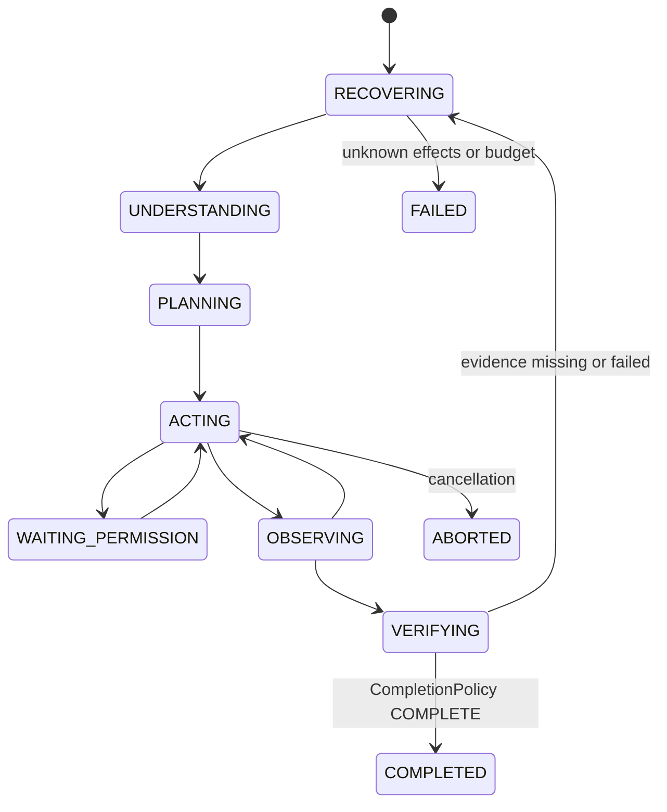

# AgentLoop

1. Acquire ownership, inspect interrupted turns/actions, repair missing tool-result messages without replaying tools.
2. For a narrowly recognized failing-tests task, run the trusted test before modifications and retain failing baseline evidence.
3. Promote all pending steers at a safe boundary. Queue promotes one input only when the current task would complete.
4. Evaluate hard budgets and LoopGuard. Build bounded context; capture tool implementations.
5. Persist STARTED turn and request metadata. Invoke Provider.stream exactly once. Collect and validate the entire response before executing any tool call. Incomplete streams and duplicate call IDs cannot execute tools.
6. Persist assistant projection. Execute authorized calls sequentially, with durable intent before effects and settlement before continuing. Even models advertising parallelTools use serial local settlement in v0.1.
7. Observe tool results. A text-only response triggers trusted verification and CompletionPolicy; it cannot set session status directly.
8. On rejection, append a structured reason and continue. On missing user scenario or uncertain effects, stop with a non-complete decision. Recheck inbox after verification before committing completion.

Plan is stored as structured steps. The model can propose revisions with update_plan; cycles, missing dependencies and DONE without evidence reject. The initial plan may be empty while the model investigates. Step completion is advisory to the contract: marking all plan steps DONE does not satisfy a missing goal check.

Guard detects duplicate tool+arguments, unchanged reads, repeated errors, A/B oscillation, repeated file rewrites, failed test cycles, low evidence diversity and budgets. Responses include DIAGNOSE, CHANGE_STRATEGY, REPLAN, COMPACT_CONTEXT, STOP. Hard total caps are not reset by additional prompts, preventing unlimited budget expansion.

Context sources: Environment, Project, Instructions (root and discovered nested AGENTS.md), Git baseline, Task/Contract/User instructions, Plan, Evidence, RecentActions. Context epochs retain an immutable baseline plus durable source updates. Deterministic compaction preserves full storage history and creates a bounded summary and new baseline; it does not turn a model summary into evidence. Input-size estimates conservatively count UTF-8 bytes and reserve output capacity. If required sources do not fit, execution stops rather than silently discarding user instructions.
