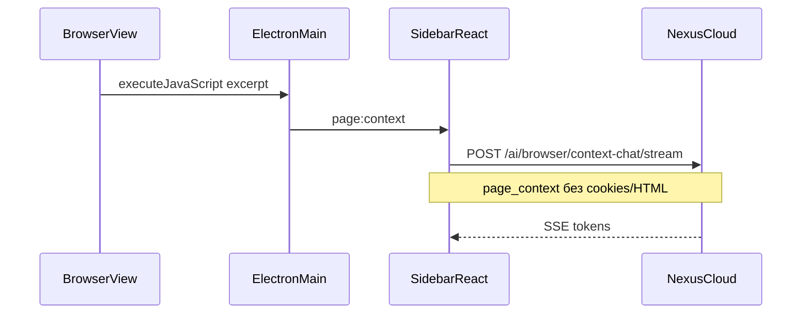

# Nexus Browser — архитектура

## Стек

| Слой | Технология |
|------|------------|
| Shell | Electron 33+ (Chromium engine) |
| Вкладки | `BrowserView` в main process |
| UI chrome | React + Vite (`nexus-browser/renderer`) |
| AI | Существующий Nexus Cloud API (`/v1/ai/*`) |
| Auth | Google OAuth через web bridge + `nexus-browser://` protocol |
| Локальные данные | JSON в `userData` (история, закладки, токены) |

## Поток page-aware чата



## Лимиты page context

- `excerpt`: до 32 000 символов (`innerText`, не HTML)
- `selection`: до 8 000 символов
- `url`, `title`: метаданные вкладки
- **Не отправляется:** cookies, localStorage, полный DOM, скриншоты (v1)

## Безопасность

- Preload + `contextIsolation`, без `nodeIntegration` в renderer
- Токены в `safeStorage` (или plaintext fallback на dev)
- Agent tools выполняются **локально** в main process
- Blocklist URL для agent: `chrome:`, `devtools:`, банковские домены (эвристика)
- Клики/ввод требуют подтверждения, если не включён режим «Авто»

## Agent loop

1. LLM отвечает с блоками ` ```nexus-browser-tool ` ` 
2. Renderer парсит JSON tools
3. Main выполняет через `webContents.executeJavaScript` / `loadURL`
4. Результаты можно передать в следующий запрос (`browser_agent_steps`)

## Auth

1. Browser открывает `{webApp}/auth/browser-login`
2. Google OAuth → `/auth/callback?exchange=...`
3. Redirect `nexus-browser://auth?exchange=...`
4. Main → `POST /auth/google/exchange` → JWT в safeStorage

## Деплой

- Сборка: `nexus-browser/scripts/build.ps1` → portable zip
- Отдельный продукт от Nexus IDE Desktop и веб-чата
- Общий аккаунт и биллинг через Render/Vercel API

## Roadmap (Chromium fork L1→L2)

- L1: custom User-Agent, иконки, default search (сделано частично)
- L2: кастомная new-tab page, отключение лишних Electron меню
- L3: полный fork Chromium UI — только при отдельном infra-ресурсе
